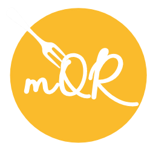

## MealQR - business purpose
We think that some of the most successful and popular apps nowadays are connected to food, and most likely to ordering food from restaurants directly to your door. We analyzed already existing apps and found a great field for upgrading them. We want to make choosing food even more convenient for users, especially the people who can never decide on one dish or who are bored of ordering the same thing over and over again. We want to make these choices easier for them and enclose everything in a user-friendly mobile-oriented web app that will make ordering food fun! 

The main feature is swiping left and right on a picture of a suggested dish. We believe that in this way we will make it easier for the client to make a choice and encourage him to try new items from various restaurants. 

As for our target groups, we are aiming for people between the ages of around 18 to even 40. We think that this age group uses food ordering apps the most, and we know that people in this age range are the most open to modern applications and innovative solutions. We plan to reach our target user using advertisements on social media platforms, as well as some leaflets in the restaurants cooperating with us

## Git flow
For each feature create a new branch from **dev** branch with a name **feature-{feature-name}**